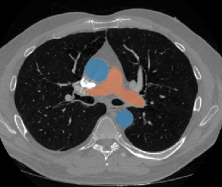
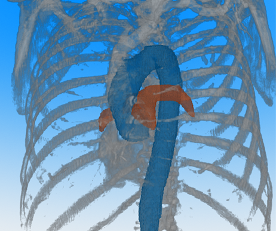

# Automated PA:A Ratio Measurement from CT Scans 

Welcome to the repository for our project on automated measurement of the **Pulmonary Artery to Ascending Aorta (PA:A) ratio**. This code provides a fully automated pipeline for extracting and analyzing key vascular structures from CT scans, enabling rapid and reproducible PA:A ratio measurements.

## About the Project

The PA:A ratio is a clinically significant metric that can provide insights into various cardiopulmonary conditions like pulmonary hypertension. Traditionally, measuring this ratio involves either fully manual techniques or semi-automated software that still require significant user input. Our solution leverages **TotalSegmentator**, a state-of-the-art deep learning tool for medical image segmentation, to fully automate the process.

### **Axial segmented Aorta and Pulmonary Artery**
 

### **3D Segmentation**


### Key Features:
- **Automated Segmentation:** The ascending aorta and pulmonary artery are segmented directly from CT scans using TotalSegmentator.
- **Connected Component Analysis and Skeletonization:** The ascending aorta and pulmonary artery volumes are isolated using connected component analysis for the aorta and skeletonization for the pulmonary artery.
- **Diameter Estimation:** All voxels above the 99th percentile of the geodesic distance transforms are averaged and multiplied by 2 to estimate vessel diameters.
- **Validation:** Our method was evaluated against semi-automated software solutions and manual measurements by experts, demonstrating strong agreement and efficiency.
- **Research Application:** The code was used in a study presented as a poster at European Respiratory Society (ERS) Congress. 

[**Reproducibility of automated and manual determination of the pulmonary artery to aorta ratio (PA:A) of ‘real-world’ CT scans**](https://publications.ersnet.org/content/erj/64/suppl68/pa1657) *(2024)*

---

## How It Works


1. **Input Data:** Accepts CT scans in DICOM or NIfTI format.
2. **Segmentation:** TotalSegmentator is used to identify the pulmonary artery and ascending aorta.
3. **Preprocessing:**
   - Connected component analysis isolates the ascending aorta.
   - Skeletonization and morphological operations remove branches and refine the pulmonary artery.
4. **Diameter Estimation:**
   - Geodesic distance transforms provide a robust method for measuring diameters.
   - Additional measurements are obtained via oblique slicing and region property analysis.
5. **Output:** 
   - Generates the PA:A ratio and a detailed table of vessel properties.
   - Optional visualizations include segmentation overlays and skeletonized structures.

---

## MATLAB Implementation

This repository includes a MATLAB implementation for processing and analyzing CT scans:

### Core Components:
- **Volume Loading:** Handles various CT scan formats and segmentation outputs.
- **Segmentation Isolation:** Processes output from TotalSegmentator to isolate key structures.
- **Measurement Pipeline:** Implements multiple methods for diameter estimation, including:
  - Geodesic distance transforms.
  - Skeletonized oblique slicing.
- **Visualization:** Tools to inspect segmentations and intermediate processing steps.

### Output:
- A structured table with patient-specific metrics, including:
  - Mean diameters (via multiple methods).
  - Morphological properties of oblique slices.
  - Calculated PA:A ratios.

---

## Usage

1. **Prerequisites:**
   - MATLAB R2021a or newer.
   - Required toolboxes: Image Processing Toolbox.
   - Install **TotalSegmentator** to generate segmentation files.    Follow the installation instructions on the [TotalSegmentator GitHub page](https://github.com/wasserth/TotalSegmentator).

2. **Run the Script:**
   Configure the patient ID and path in `main.m`, then execute the script:
   ```matlab
   run main.m
   ```

3. **Output:**
   - A structured table of vessel properties.
   - Visualization of segmentation and skeletonization results.

---

## Validation

This pipeline was validated through:
- Comparison with semi-automated software.
- Manual measurements performed by expert radiologists.
- Results presented at the European Respiratory Society International Congress.  

The findings were presented as a poster at the European Respiratory Society International Congress.  
[**Link to the abstract**](https://publications.ersnet.org/content/erj/64/suppl68/pa1657)

---

## Contributions

We welcome contributions to enhance functionality, improve performance, or expand the scope of this project. Feel free to open issues, submit pull requests, or share feedback.

---

## License

This project is licensed under the [MIT License](LICENSE).

---

For questions, feedback, or collaboration inquiries, please contact [luis.gonzaleztorres@mail.mcgill.ca].

---
